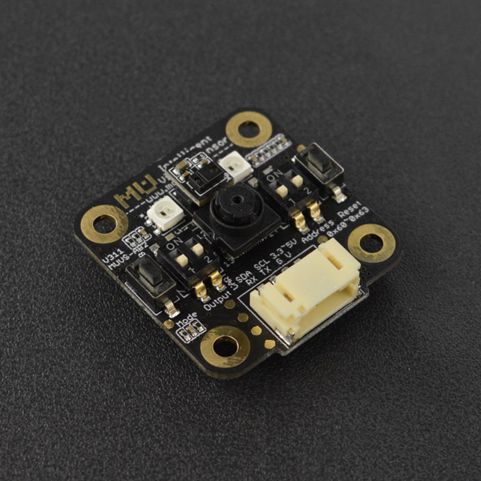

# DFRobot_MuVisionSensor
- [中文版](./README_CN.md)

The MU Vision Sensor is a sensor module that supports Arduino, Microbit, and other haredware platform that supports UART or I2C communication protocols.

You can use these libraries to read data or set properties of the MU Vision Sensor.




## Product Link (https://www.dfrobot.com/product-1905.html)
  SKU: SEN0314


## Table of Contents

* [Summary](#summary)
* [Installation](#installation)
* [Methods](#methods)
* [Compatibility](#compatibility)
* [History](#history)
* [Credits](#credits)


## Summary

* Suitable for all kinds of Vision course application.
* Smart print and scan robot car
* Intelligent unmanned vehicle
* Basketball shooting robot
* Low power consumption and small in size
* Easy to use; support UART, I2C, WIFI communication mode; suitable for Arduino and micro:bit embedded development
* Reliable and secure: all vision algorithms are processed locally without the restraint of network connection


## Installation

There two methods:

1. To use this library, first download the library file, paste it into the \Arduino\libraries directory, then open the examples folder and run the demo in the folder.
2. Search the DFRobot_MuVisionSensor library from the Arduino Software Library Manager and download it.


## Methods

```C++
  /**
    * @brief  construct class MU vision sensor.
    * @param  address: MU vision sensor device address.
    * @retval none
    */
  DFRobot_MuVisionSensor(uint32_t address = 0x60);
  virtual ~DFRobot_MuVisionSensor();

  /**
    * @ TODO WARNING this function may delete in later version, please use `begin(communicationPort)` instead.
    * @brief  MU vision sensor begin.
    * @param  communicationPort: MuVsI2C(i2c) or MuVsUart(uart).
    * @param  mode: kSerialMode
    *               kI2CMode
    * @retval MU_OK: begin success.
    *         other: protocol assert fail.
    */
  uint8_t __attribute__ ((deprecated("\n***WARNING*** function `begin(communicationPort, mode)` has been deprecated, and may delete in later version, please use `begin(communicationPort)` instead.")))
          begin(void* communicationPort,
                muVsMode mode);
  /**
    * @brief  MU vision sensor begin.
    * @param  communicationPort: MuVsUart(uart).
    * @retval MU_OK: begin success.
    *         other: protocol assert fail.
    */
  uint8_t begin(MuVsUart* communicationPort);
  /**
    * @brief  MU vision sensor begin.
    * @param  communicationPort: MuVsI2C(i2c).
    * @retval MU_OK: begin success.
    *         other: protocol assert fail.
    */
  uint8_t begin(MuVsI2C* communicationPort);

  // Based interface
  /**
    * @brief  begin vision.
    * @param  visionType: vision type.
    * @retval MU_OK:  success
    *         other:  error
    */
  uint8_t visionBegin(muVisionType);
  /**
    * @brief  end vision.
    * @param  visionType: vision type.
    * @retval MU_OK:  success
    *         other:  error
    */
  uint8_t visionEnd(muVisionType);
  /**
    * @brief  get vision result data, this function will update vision
    *         result automatically.
    * @param  visionType: vision type.
    * @param  objectInf:  object information
    * @retval information value
    */
  int getValue(muVisionType visionType,
               MuVsObjectInf objectInf);
  /**
    * @brief  write vision parameter.
    * @param  visionType: vision type.
    * @param  objectInf:  object information
    * @param  value:  value
    * @retval MU_OK:  success
    *         other:  error
    */
  int setValue(muVisionType visionType,
               MuVsObjectInf objectInf,
               uint8_t value) {
    return write(visionType, objectInf, value);
  }
  /**
    * @brief  get vision result buffer pointer.
    *         this function WILL NOT update vision result, please use
    *         function `updateResult([visionType])` or
    *         `getValue([visionType], kStatus)` to update vision result before this function
    * @param  visionType: vision type.
    * @retval vision result buffer pointer,
    *         return `nullptr` if the vision type is not `begin` or not supported
    */
  muVsVisionState* getVisionState(muVisionType visionType);

  // Advance interface
  /**
    * @brief  update result data from vision sensor, must used after
    *         visionBegin or visionSetStatus.
    * @param  visionType: vision type.
    * @param  waitAllResult:  true: return if get all input vision type
    *                           false: return if get one of the input vision type
    * @retval the vision type which have been updated
    */
  muVisionType updateResult(muVisionType visionType,
                            bool waitAllResult = true);
  /**
    * @brief  write vision parameter.
    * @param  visionType: vision type.
    * @param  objectInf:  object information
    * @param  value:  value
    * @retval MU_OK:  success
    *         other:  error
    */
  uint8_t write(muVisionType, MuVsObjectInf, uint8_t value);
  /**
    * @brief  read result data.
    * @param  visionType: vision type.
    * @param  objectInf:  object information
    * @retval information value
    */
  uint8_t read(muVisionType visionType,
               MuVsObjectInf objectInf,
               uint8_t resultNum = 1);

  // Sensor functions
  // @brief  restart MU vision sensor
  uint8_t sensorSetRestart(void);
  // @brief  set all register to default value(include baud rate)
  uint8_t sensorSetDefault(void);

  // LED functions
  /**
    * @brief  set led.
    * @param  led: led type.
    * @param  manual: vision type.
    * @param  hold:  object information
    * @retval MU_OK:  success
    *         other:  error
    */
  uint8_t ledSetMode(MuVsLed led, bool manual, bool hold);
  /**
    * @brief  set led color.
    * @param  led: led type.
    * @param  detectedColor: led color while sensor detected target.
    * @param  undetectedColor: led color while sensor undetected target.
    * @param  level:  led brightness, form 0(close) to 15
    * @retval MU_OK:  success
    *         other:  error
    */
  uint8_t ledSetColor(MuVsLed led,
                      MuVsLedColor detectedColor,
                      MuVsLedColor undetectedColor,
                      uint8_t level = 1);

  // Camera functions
  /**
    * @brief  set camera zoom.
    * @param  camera zoom value.
    * @retval MU_OK:  success
    *         other:  error
    */
  uint8_t cameraSetZoom(muVsCameraZoom);
  /**
    * @brief  rotate camera.
    * @param  enable: true: rotate camera.
    *                 false: default
    * @retval MU_OK:  success
    *         other:  error
    */
  uint8_t cameraSetRotate(bool enable);
  /**
    * @brief  set camera zoom.
    * @param  camera FPS type.
    * @retval MU_OK:  success
    *         other:  error
    */
  uint8_t cameraSetFPS(muVsCameraFPS);
  /**
    * @brief  set camera white balance.
    * @param  camera white balance type.
    * @retval MU_OK:  success
    *         other:  error
    */
  uint8_t cameraSetAwb(muVsCameraWhiteBalance);
  /**
    * @brief  get camera zoom value.
    * @retval camera zoom value
    */
  muVsCameraZoom cameraGetZoom(void);
  /**
    * @brief  get camera AWB type.
    * @retval camera AWB type
    */
  muVsCameraWhiteBalance cameraGetAwb(void);
  /**
    * @brief  get camera rotate state.
    * @retval camera rotate state
    */
  bool cameraGetRotate(void);
  /**
    * @brief  get camera FPS type.
    * @retval camera FPS type
    */
  muVsCameraFPS cameraGetFPS(void);

  // Uart functions
  /**
    * @brief  set UART baud rate.
    * @param  UART baud rate.
    * @retval MU_OK:  success
    *         other:  error
    */
  uint8_t uartSetBaudrate(muVsBaudrate baud);

  // Vision functions
  /**
    * @brief  set vision status.
    * @param  visionType: vision type
    * @param  enable: true: enable vision
    *                 false: disable vision
    * @retval MU_OK:  success
    *         other:  error
    */
  uint8_t visionSetStatus(muVisionType visionType, bool enable);
  /**
    * @brief  set vision status.
    * @param  visionType: vision type
    * @param  mode: output mode
    * @retval MU_OK:  success
    *         other:  error
    */
  uint8_t visionSetOutputMode(muVsStreamOutputMode mode);
  /**
    * @brief  output enable.
    * @param  visionType: vision type
    * @param  status: true: start output
    *                 false: stop output
    * @retval MU_OK:  success
    *         other:  error
    */
  uint8_t visionSetOutputEnable(muVisionType visionType, bool status);
  /**
    * @brief  set vision configure to default value.
    * @param  visionType: vision type
    * @retval MU_OK:  success
    *         other:  error
    */
  uint8_t visionSetDefault(muVisionType visionType);
  /**
    * @brief  set vision level.
    * @param  visionType: vision type
    * @param  level: vision level
    * @retval MU_OK:  success
    *         other:  error
    */
  uint8_t visionSetLevel(muVisionType visionType,
                         muVsVisionLevel level);
  /**
    * @brief  get vision status.
    * @retval vision status
    */
  bool visionGetStatus(muVisionType visionType);
  /**
    * @brief  get vision level.
    * @retval vision level
    */
  muVsVisionLevel visionGetLevel(muVisionType visionType);
  /**
    * @brief  get vision output mode.
    * @retval vision output mode
    */
  muVsStreamOutputMode visionGetOutputMode(void);
```


## Compatibility

MCU                | Work Well    | Work Wrong   | Untested    | Remarks
------------------ | :----------: | :----------: | :---------: | -----
Arduino Uno        |      √       |              |             | 


## History

- 2023/06/29 - Version 1.1.7 released.


## Credits

Written by DFRobot, 2023. (Welcome to our [website](https://www.dfrobot.com/))
